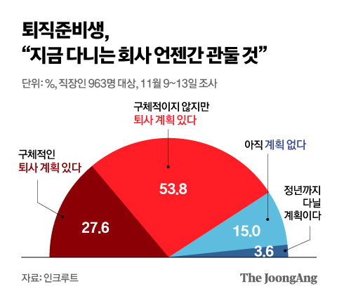
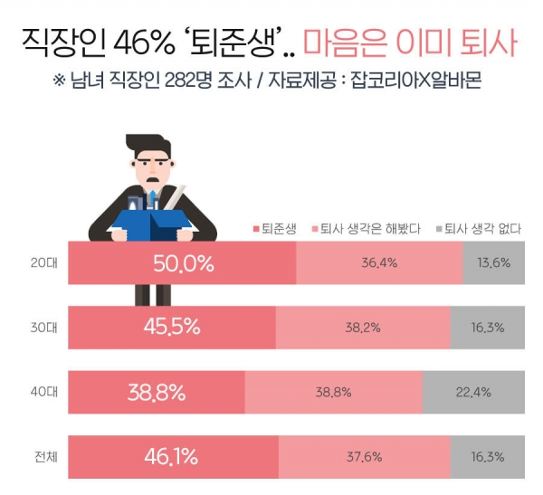
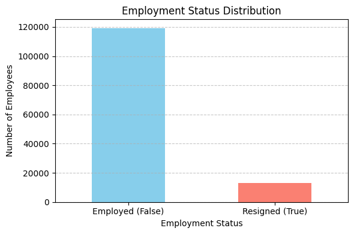
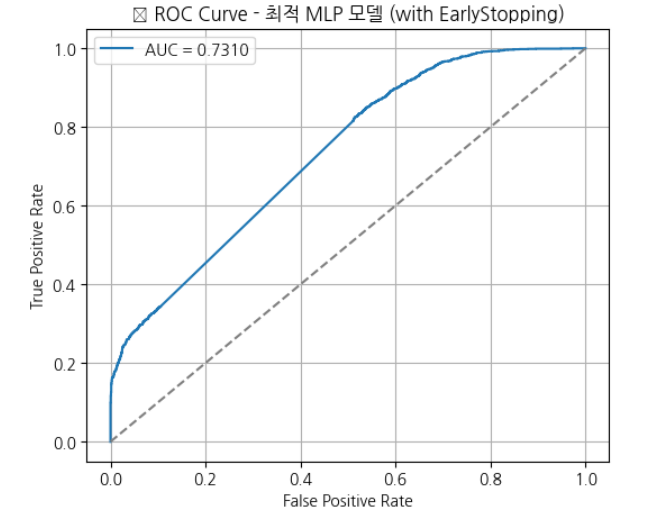
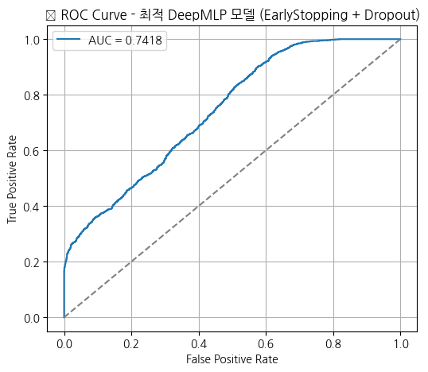
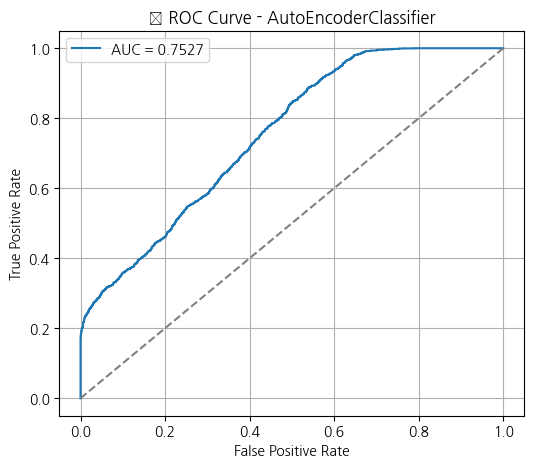
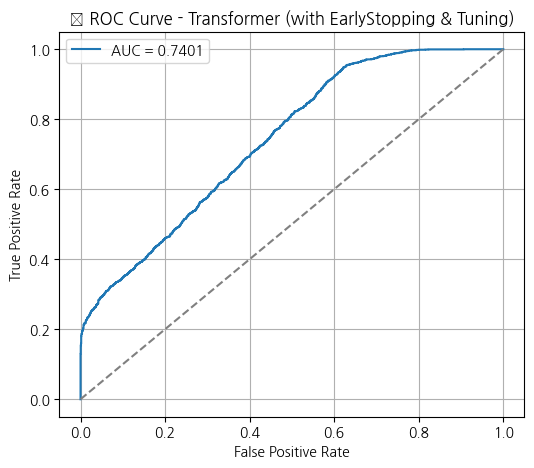
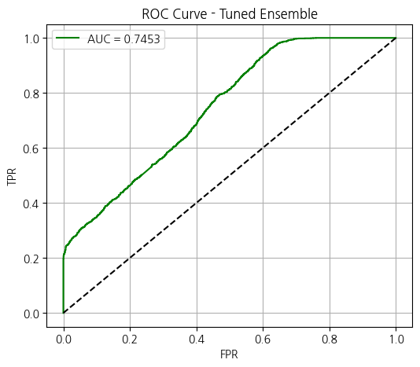
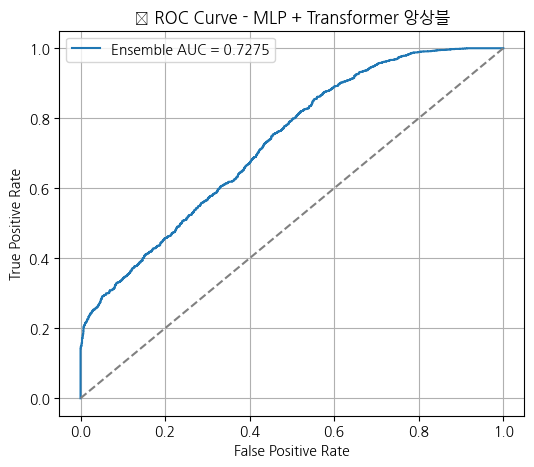

# SKN16-2nd-3Team
## 😑 퇴사자 잡으러가조
### 팀 소개

|  | |  |  |  |
|---|---|---|---|---|
|이용채|김나은|임종민|차하경|김민석|
|프로젝트 기획, 목표 설정, 결과 정리, 최종 보고서 작성, 발표|모델 실험, 머신러닝 성능 개선, 하이퍼파라미터 튜닝|피처 선정, 데이터 분석, 머신러닝 모델 시험|데이터 전처리 전략, 딥러닝 최적화, 하이퍼파라미터 튜닝|데이터 수집, 데이터 전처리, 초기 모델 테스트|

<br>


## 프로젝트 개요
### 주제 선정 배경
||
|:---:|:---:|
|[이미지 출처](https://www.dailycc.net/news/articleView.html?idxno=519587)|[이미지 출처](https://www.joongang.co.kr/article/25208479)|

최근 직장인 사이에서 **'퇴준생(퇴사를 준비하는 직장인)'** 이라는 용어가 보편화될 만큼, 많은 직장인들이 이직이나 퇴사를 진지하게 고려하고 있다는 조사 결과가 이어지고 있다. 이러한 현상은 평생직장의 개념이 사라지고, 연봉·워라밸·기업의 미래 등 자신의 가치관에 맞는 직장을 적극적으로 찾아 나서는 분위기가 확산된 데 기인한다. 이는 특히 MZ세대를 중심으로 회사와 자신의 **방향성이 맞지 않는다고 판단되면 빠르게 진로를 전환하는 경향이 두드러진다.** 이처럼 퇴사를 고려하는 직장인이 증가하는 사회적 흐름 속에서, 조직은 **인재 유출에 대비하고 인사 전략을 강화** 할 필요가 있다. 따라서 본 프로젝트는 HR 데이터셋을 기반으로 퇴사자 예측 모델을 생성하여 인적 자원의 이탈 가능성을 조기에 감지하고 대응할 수 있는 기반을 마련하고자 한다.


<br>

### 분석 목적
본 프로젝트의 목적은 사내 인사 데이터를 바탕으로 직원의 이탈 여부를 예측하는 모델을 개발하여 이탈 가능성이 높은 직원을 사전에 파악하고, 이를 바탕으로 조직의 인적 리스크 관리의 유용성을 높이는 것이다. 
<br>


<br>

## 데이터셋 개요

**기업 HR 데이터셋**을 사용하였으며, 해당 데이터셋에는 근무 환경에서 직원 성과, 생산성 및 인구 통계와 관련된 주요 측면을 파악할 수 있는 데이터가 포함되어 있다.

데이터 출처: [Kaggle, Employee Performance and Productivity Data](https://www.kaggle.com/datasets/mexwell/employee-performance-and-productivity-data)

<br>

### 데이터프레임 구조

**총 행 수**: 100,000

**총 열 수**: 20

**데이터 타입**: bool(1), float64(1), int64(13), object(5)

**메모리 사용량**: 14.6+ MB


| 변수명                     | Not null 개수 | 데이터 타입 | 변수 설명 |
|:--------------------------:|:---------:|:-----------:|:-----:|
| Employee_ID              | 100,000    | int64       | 각 직원의 고유 식별자 |
| Department               | 100,000    | object      | 근무 부서(예: 영업, 인사, IT)|
| Gender                   | 100,000    | object      | 성별(남성, 여성, 기타)|
| Age                      | 100,000    | int64       | 연령(22~60세)|
| Job_Title                | 100,000    | object      | 맡은 역할(예: 관리자, 분석가, 개발자)|
| Hire_Date                | 100,000    | object      | 고용된 날짜|
| Years_At_Company         | 100,000    | int64       | 회사에서 근무한 연수|
| Education_Level          | 100,000    | object      | 최종 학력(고등학교, 학사, 석사, 박사)|
| Performance_Score        | 100,000    | int64       | 성과 평가(1~5점 척도)|
| Monthly_Salary           | 100,000    | int64       | 직책과 성과 점수에 따른 월급(USD)|
| Work_Hours_Per_Week      | 100,000    | int64       | 주당 근무 시간 수|
| Projects_Handled         | 100,000    | int64       | 총 수행 프로젝트 수|
| Overtime_Hours           | 100,000    | int64       | 지난 1년 동안 총 초과근무 시간|
| Sick_Days                | 100,000    | int64       | 사용 병가일 수|
| Remote_Work_Frequency    | 100,000    | int64       | 원격으로 근무한 시간의 백분율(0%, 25%, 50%, 75%, 100%)|
| Team_Size                | 100,000    | int64       | 소속 팀의 인원 수|
| Training_Hours           | 100,000    | int64       | 교육에 소요된 시간|
| Promotions               | 100,000    | int64       | 근무 기간 동안 승진 횟수|
| Employee_Satisfaction_Score | 100,000 | float64     | 직원 만족도 평가(1.0~5.0 척도)|
| Resigned                 | 100,000    | bool        | 퇴직 여부(퇴직: 1, 재직: 0)|

<br>

### 데이터 전처리 과정
**결측치 및 이상치 처리**

모든 컬럼에서 결측치는 발견되지 않았기 때문의 별도의 결측치 처리 과정은 거치지 않았다. **Gender 컬럼에 other로 기록 되어 있는 데이터가 Male, Female에 비해 매우 드물기 때문에 이상치로 판단하여 제거** 하였다.

<br>

**클래스 가중치 부여**

- 1차 모델링 및 예측 결과

||
|:---:|

<br>

- 범주형 변수의 클래스별 퇴사율
  
|||
|:---:|:---:|
|교육수준별 퇴사율|근무부서별 퇴사율|
|||
|원격근무 빈도별 퇴사율|직무별 퇴사율|

<br>

**가중치를 부여하지 않은 초기 데이터로 모델링하여 예측한 결과, 모든 모델의 AUC 값이 0.5 근처로 무작위 추측 수준의 성능을 보였음.** 이는 target의 클래스(퇴직/재직)에 따른 독립변수의 분포가 지나치게 유사해, 모델이 패턴을 학습하지 못했기 때문임. 따라서 주요 target 클래스인 **퇴직자 데이터의 독립변수 일부에 가중치를 부여하여 분포의 차이를 생성함.**

 Work_Hours_Per_Week 10%↑
 
 Projects_Handled 10%↓
 
 Overtime_Hours 10%↑
 
 Training_Hours 10%↓
 
 Employee_Satisfaction_Score 10%↓
 
<br>


<br> 

- 가중치 조절에 따른 수치형 변수의 분포 차이
  
|||
|:---:|:---:|
|가중치 조절 전 직원 만족도 Boxplot. 퇴직자와 재직자의 만족도 분포 차이가 거의 없음.|가중치 부여하여 인위적으로 분포의 차이를 만듦.|

<br>

**샘플링**

||
|:---:|
|퇴직자 재직자 비율. 클래스 불균형을 볼 수 있음.|

**Target인 Resigned 변수는 퇴직자(1)와 재직자(0)의 비율이 약 9:1로 클래스가 매우 불균형한 데이터이다.** 이러한 경우 많은 모델이 데이터의 대부분을 차지하는 다수 클래스에 치우친 예측을 하기 때문에 정확도는 높아보일지 몰라도 의미 있는 예측을 하기 어렵다. 하지만 이탈 예측 모델 같은 경우 소수 클래스인 퇴직을 분류하는 것이 더 중요하기 때문에 불균형을 해소할 필요가 있다.  

**클래스의 불균형을 해소하기 위해 다음과 같은 샘플링 기법을 적용하여 균형을 맞추었다.**
- **Over Sampling**: 소수 클래스의 데이터를 다수 클래스의 데이터 수에 맞게 증가시키는 방식으로, 여기선 Resampling을 사용. 퇴사자(Resigned: 1)를 무작위로 복제하여 10,000명으로 증가시킴.  
- **Under Sampling**: 다수 클래스의 데이터를 소수 클래스 데이터 수에 맞게 줄이는 방식으로, 여기선 Random Sampling을 사용. 재직자(Resigned: 0) 10,000명 무작위 추출.


<br>

## 분석결과
### 머신러닝 모델

**성능 평가 및 비교**
| 모델         | Accuracy | F1-score |Recall(퇴직자)|   AUC   |
|:------------|:--------|:--------------|:-------|-------|
| Logistic Regression          |   0.90   |0.85|     0.00       | 0.49  |
| Decision Tree      |   0.80   |     0.81      |0.12| 0.50  |
| RandomForest      |   0.90   |     0.85       |0.00| 0.49  |

- **Logistirc Regression**: 재직자(0)은 잘 예측하지만, **퇴직자(1)은 완전히 무시하는 편향이 발생함.** 퇴직자와 재직자의 구분 규칙을 단순 선형 결정 경계로는 파악할 수 없음을 알 수 있음. 따라서 실제 이탈 예측 모델로 활용하기에는 적합하지 않음.
- **Decision Tree**: 퇴직자(1)를 조금은 예측하려고 시도함. **균형 잡힌 예측 시도는 긍정적이나 정확도는 낮음.** 
- **RandomForest**: 재직자(0) 예측은 매우 정확하지만, **퇴직자(1) 에 대해 Logistic Regression과 동일한 결과 불균형 클래스에 대해 취약함.** 

<br>   
  
### 딥러닝 모델

**모델링 개요**

일부 머신러닝 모델은 재직자 예측에는 좋은 성능을 보였으나, 이탈 예측 모델의 핵심인 **퇴직자 예측에서는 매우 낮은 Recall이나 완전한 편향 등 한계가 드러났다.** 이는 특히 Logistic Regression 모델에서 뚜렷하게 나타났고, RandomForest 모델 또한 퇴직자를 일부 놓치는 결과를 보였다. Decision Tree는 모든 성능 지표에서 높은 값을 보였지만 과적합의 우려가 존재했다. 이에 따라 **딥러닝 기반 모델을 추가적으로 설계하여 성능을 비교하고 최종적으로 모델을 선정했다.** 

<br>

**성능 비교 및 모델 선정**

| 모델(Early Stopping + Dropout 적용)          | Accuracy | Macro F1-score |   AUC   | Best Threshold |
|:---------------------------------------------|:---------|:---------------|:--------|:---------------|
| MLP                    |   0.66   |     0.64       | 0.73    |      0.54      |
| DeepMLP                                      |   0.66   |     0.65       | 0.74    |      0.48      |
| Transformer    |   0.65   |     0.65       | 0.74    |      0.50      |
| Autoencoder Classifier                       |   0.67   |     0.66       | 0.75    |      0.46      |
| MLP + DeepMLP|   0.66   |     0.65       |0.75     |       -        |
|Transformer + MLP                             |   0.65   |     0.64       |  0.72   |      0.49      |


- **MLP**: 기본적인 딥러닝 구조의 모델이지만 비선형적 관계를 비교적 효과적으로 학습함. **하지만 재직자(0)에 대한 Recall 값이 낮아 균형적 예측에 대한 성능은 다소 떨어진다고 볼 수 있음.**
- **DeepMLP**: Dropout 및 BatchNorm을 활용하여 regularization 효과를 넣었으나, 성능은 MLP보다 낮았다. 복잡한 구조가 오히려 일반화에 방해가 되었을 가능성이 있다. 하지만 하이퍼파라미터 튜닝을 통해 향상될 가능성이 있다고 판단하였다.
- **Transformer**: 소수 클래스의 데이터(퇴직자)를 탐지하기 적합한 구조의 모델로, Recall 0.83의 높은 값을 나타냄. 하지만 재직자 예측에 대해서는 퇴직자 예측보다는 낮은 성능으로 **False Positive에 대한 우려가 존재함.**
- **AutoEncoder Classifier**:입력 데이터를 잠재 공간으로 압축한 후, 해당 벡터를 기반으로 분류를 진행하는 모델. 성능은 DeepMLP와 유사했으며, AUC는 0.5728로 중간 수준.
- **MLP + DeepMLP**: Dropout과 Early Stopping을 적용하여 과적합을 방지하였음. **퇴직자 Recall이 전체 모델 중 가장 높게 나타남.** 재직자 예측에 대해서는 퇴직자에 비해서 약하지만, False Negative를 방지하고 퇴직자를 탐지하는 것이 더 중요하기 때문에 유용한 모델이라고 볼 수 있음.


<br>

|ROC-Curve|모델|Best Parameters|
|:---|:---|:---|
||MLP| ```hidden1: 200``` ```hidden2: 74``` ```lr: 0.008040853765733618``` ```batch_size: 128```|
||DeepMLP|```hidden1: 174``` ```hidden2: 89``` ```dropout: 0.4907642593510716``` ```lr: 0.0020379497782479967``` ```batch_size: 128```|
||AutoEncoder|```encoding_dim: 96``` ```dropout_rate: 0.27937315793717066``` ```lr: 0.00939236014289022``` ```batch_size: 128```|
||Transformer|```d_model: 32``` ```nhead: 2``` ```num_layers: 1``` ```dropout: 0.24372847923584276``` ```lr: 0.002500389542492971``` ```batch_size: 128```|
||MLP + DeepMLP 앙상블 모델|```hidden_dim1: 66``` ```hidden_dim2: 53``` ```dropout: 0.4091386964275948``` ```lr: 0.008331419334917479``` ```batch_size: 128```|
|| Transformer + MLP 앙상블 모델|```d_model: 128``` ```nhead: 8``` ```num_layers: 3``` ```dropout: 0.2281870695395805``` ```lr: 0.00015211612225622003``` ```batch_size: 128```|

### 최종 모델 선정 및 결론
✅ 최종 추천: **MLP + DeepMLP 앙상블 모델**

MLP모델은 비교적 간단한 신경망 구조임에도 불구하고, 변수 간 비선형 관계를 학습하는데 효과적이다. 하지만 단일 MLP의 구조만으로는 복잡한 패턴을 포착하는데 한계가 있다고 판단하여 보다 고도화된 DeepMLP 모델을 설계하였다. 모델 튜닝 단계에서는 Optuna를 기반으로 한 Bayesian Optimization 방식의 Hyperparameter 튜닝을 사용하였다. 이를 통해 각 모델의 best parameters를 확보한 뒤 앙상블 모델에 활용하였다. 최종적으로 MLP와 DeepMLP의 예측 결과를 단순 평균 방식으로 앙상블한 결과, **퇴직자(1) 클래스에 대한 Recall은 0.85, Precision은 0.63** 으로 나타났으며, 이는 모든 실험 모델 중 **가장 높은 퇴직자 탐지 성능** 을 보였다. **AUC 또한 0.7453으로 우수한 분류 성능** 을 유지하였다. 이처럼 두 딥러닝 구조를 결합함으로써 모델 간의 편향을 보완하고, 재직자와 퇴사자 클래스 간 예측 균형을 확보할 수 있었다. 해당 모델은 특히 **False Negative를 최소화하는 데 강점이 있으며** , 이는 실제 퇴사 가능성이 있는 인재를 놓치지 않고 탐지한다는 점에서 유용성을 지닌다. 
